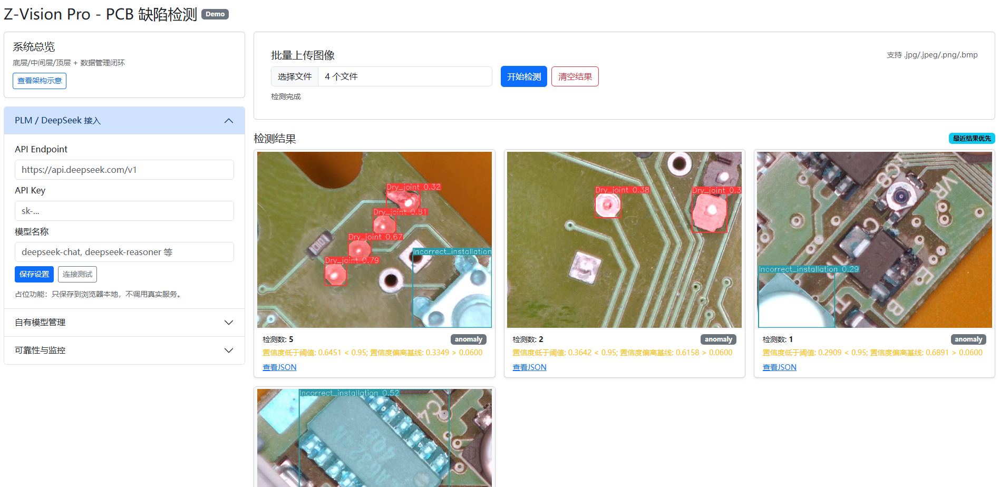

## 项目简介

PCB 缺陷检测与可视化项目，提供离线脚本推理与简易 Web 可视化界面，支持常见 PCB 表面缺陷检测（短路、杂铜、断路等）。

## 功能特性
- 推理脚本：一键对图片/目录进行缺陷检测与标注可视化。
- Web 界面：本地上传图片并查看检测结果（`web_app/`）。
- 数据支持：内置 COCO/YOLO 标注格式的数据组织结构（见 `data/`）。

## 目录结构
- `data/`：数据集（`train/`、`valid/`、`test/`），包含 `COCO` 标注示例（如 `valid/_annotations.coco.json`）。
- `web_app/`：Web 应用（Flask），含前端静态资源与模板。
- `Z-VisionPro-pcb-detection.py`、`Z-VisionPro-pcb-detection-v1.0.py`、`pcb-detection-v1.0.py`：检测脚本示例。
- `requirements.txt`：项目依赖。
- `setup_env.bat` / `setup_env.sh`：环境初始化脚本。

## 快速开始
1) 创建并激活虚拟环境（可选）
- Windows（PowerShell）：
```bash
./setup_env.bat
```
- Linux/macOS：
```bash
bash setup_env.sh
```

2) 安装依赖
```bash
pip install -r requirements.txt
```

3) 运行检测脚本（示例，按需选择脚本与参数）
```bash
python Z-VisionPro-pcb-detection.py --source path/to/image_or_dir --output runs/
```

4) 启动 Web 应用
```bash
python web_app/app.py
```
浏览器访问 `http://127.0.0.1:5000`，上传图片查看检测结果。

## 项目截图
项目期中效果展示：



## 数据集说明（简要）
- 本项目采用 PCB 表面缺陷数据，已提供 COCO/YOLO 格式示例，便于直接训练或评估。
- 如需自定义数据与标注，请将图像与标注文件放入 `data/train`, `data/valid`, `data/test` 目录结构中。

## 备注
- 若需复现实验或更换模型，请根据脚本内注释与参数提示进行修改。
- 依赖版本与环境差异可能影响运行效果，建议使用提供的虚拟环境脚本进行初始化。
